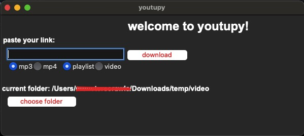
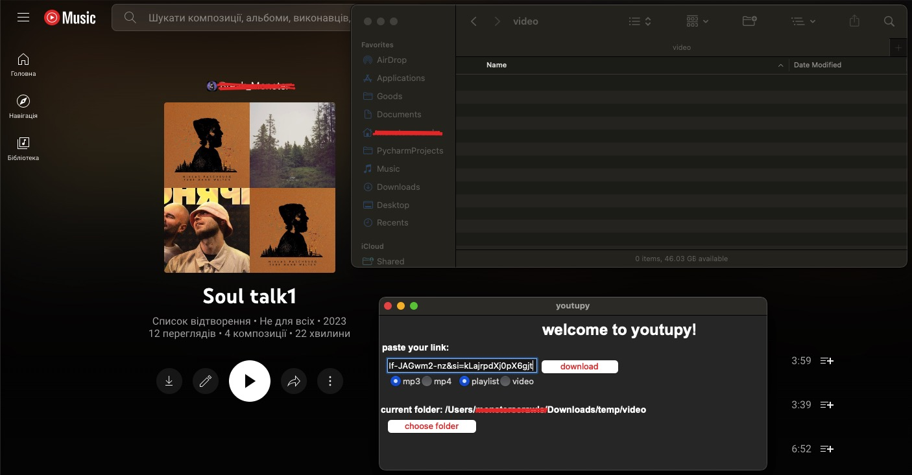
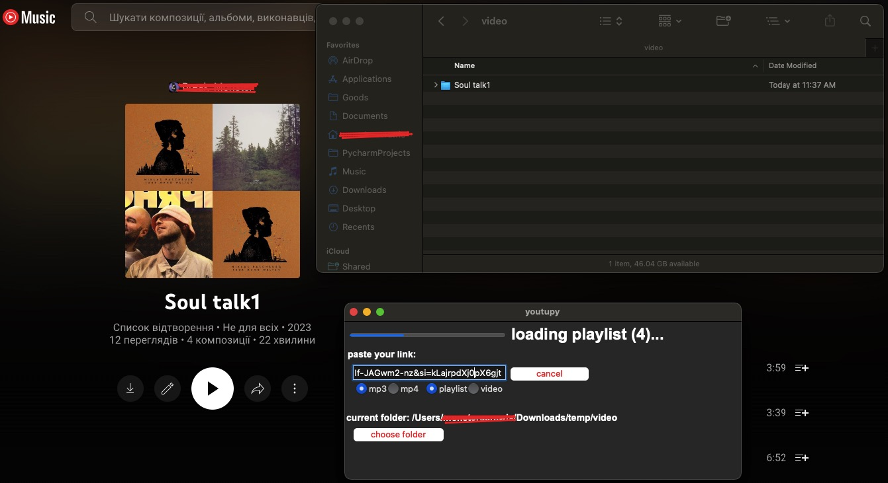
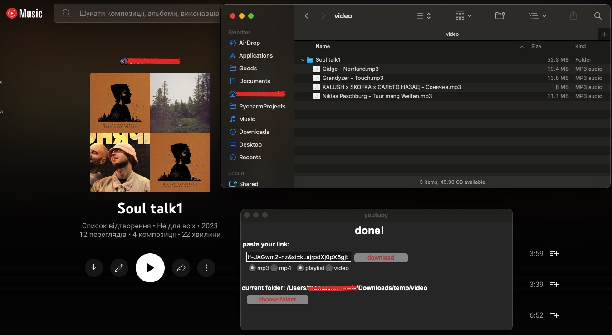

# Youtupy

Youtupy is a small Python application with a graphical user interface (GUI) built using Tkinter. It leverages the Pytube library to download YouTube playlists and single songs/videos to a specified directory on your PC.

## Features

- Download individual videos or entire playlists from YouTube
- Simple and intuitive graphical user interface
- Option to specify the download directory
- Supports both audio and video downloads
- Highest available resolution video downloads
- Download progress indicator

## Screenshots

*Main Screen*<br>


*Paste playlist link*


*Download in Progress*


*Playlist loaded*


## Installation

### Prerequisites

- Python 3.8+

### Install Dependencies

First, ensure you have the required libraries installed. You can use `pip` to install the necessary packages.

```sh
    pip install -r requirements.txt 
```
